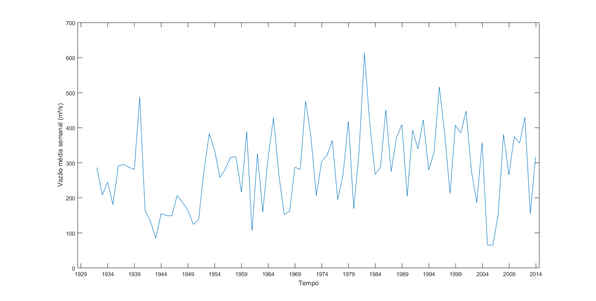
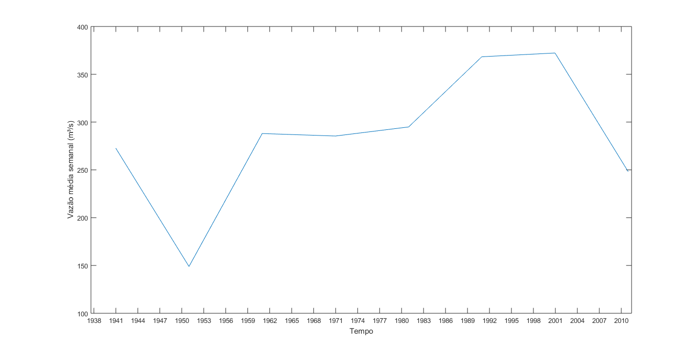
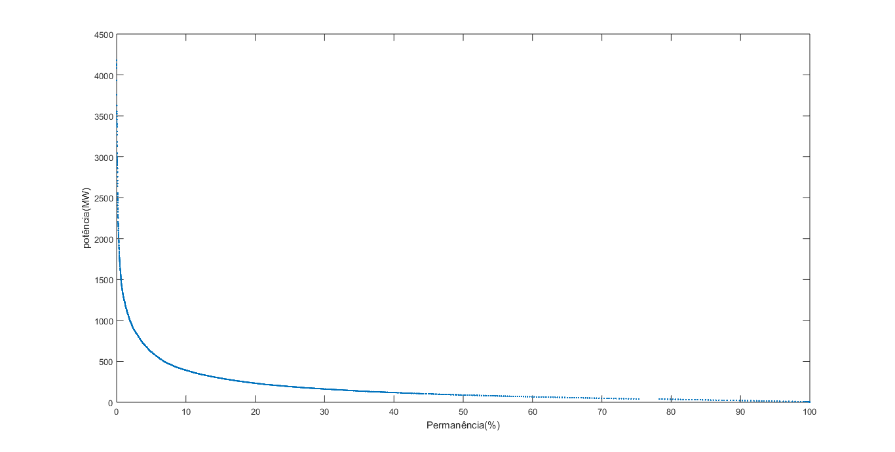
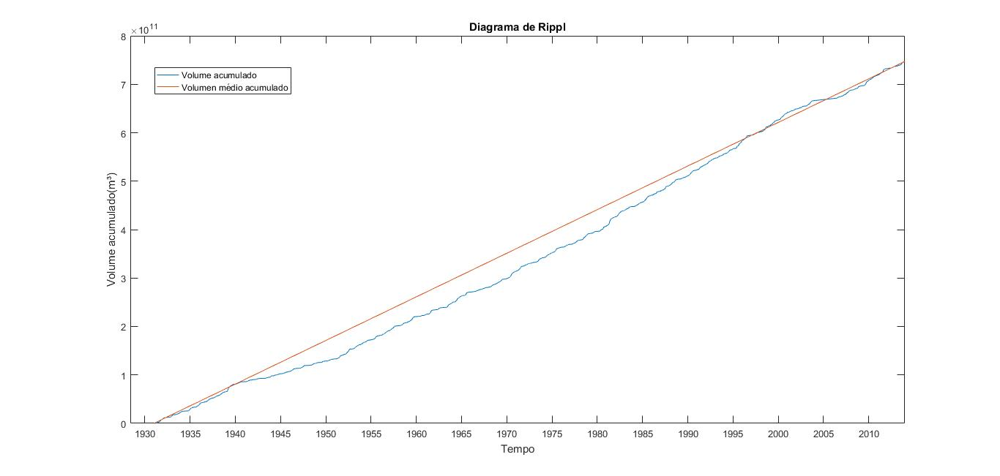
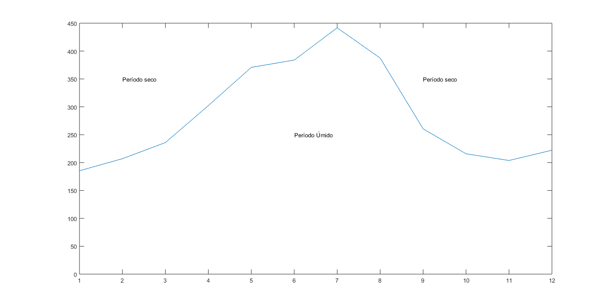
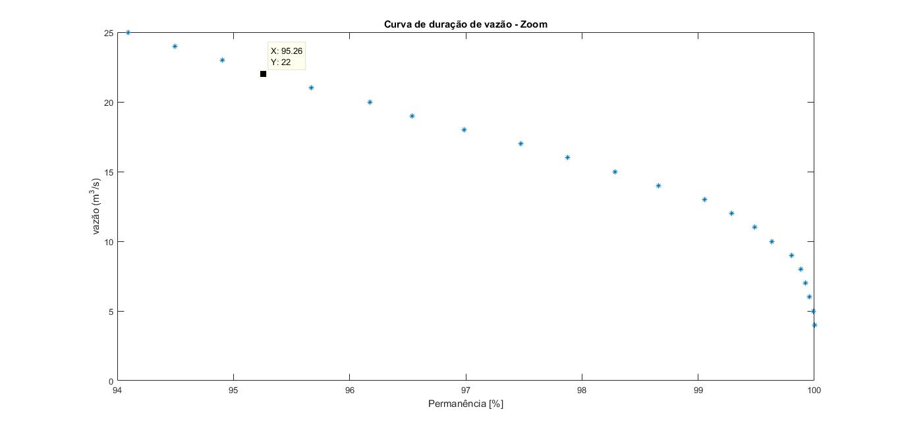
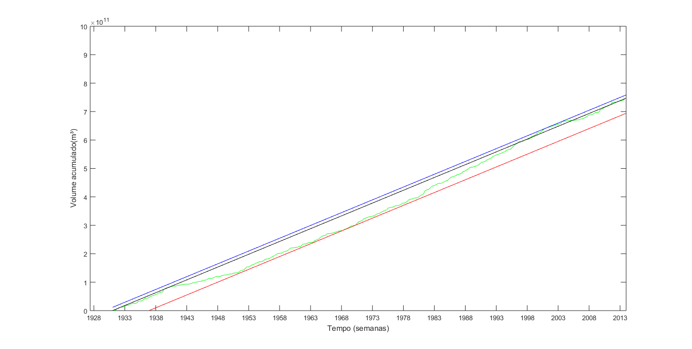
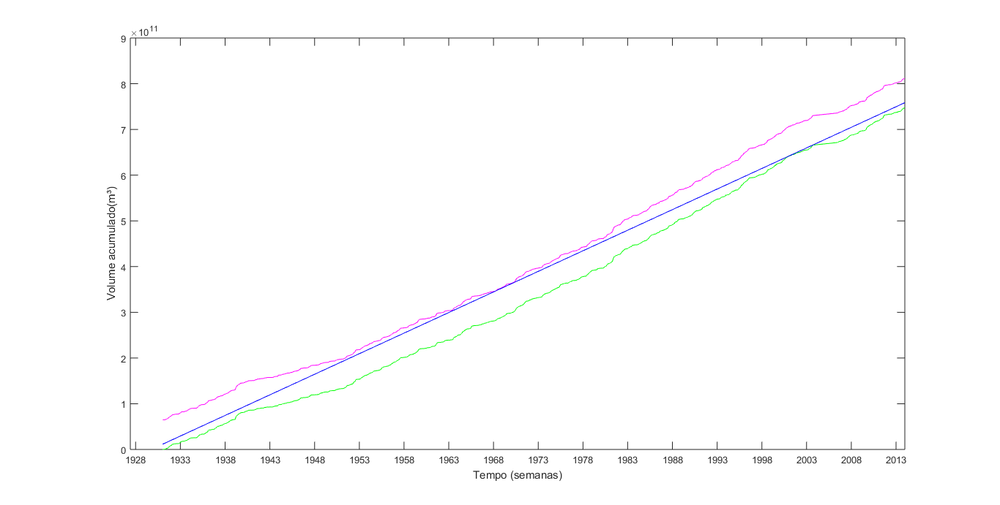
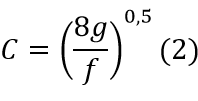

# PROJETO HIDROELÉTRICO

  - João Pedro Alemonge Honorato - 15/00113019
  - Brenda Bianca Neves Dias - 15/0119593
  - Igor Veneroso do Nascimento - 13/0114740
  - Victor Miguel Cunha de Sousa - 14/0087729

### Projeto do Aproveitamento - Nota: 7,0

O projeto do aproveitamento consistirá na realização e apresentação de cálculos oriundos de dados de um dado aproveitamento hidrelétrico visando a instalação de uma usina hidrelétrica. Cada item deverá ser respondido neste documento do repositório, usando a ferramenta de edição.

  - Cada grupo terá em sua pasta do repositório um conjunto de dados de vazão que deverá ser usado ao longo deste e dos demais projetos quando necessário;
  
  - Modelamento do aproveitamento hidrelétrico. Cada grupo deverá mostrar como ficará o sistema hidromecânico equivalente através do cálculo da energia hidráulica média disponível e do trabalho específico. O grupo 1 deverá usar a  altura de cota **de 70 m** para seu aproveitamento hidrelétrico:
       
       + Considerando os princípios de conservação de massa e energia entre os níveis de montante e jusante, temos:
       
         Trabalho específico:
       
         
       
         Energia hidráulica média disponível: 
       
         
	
       + Considerando que os reservatórios da montante e jusante estão sob a pressão atmosférica:
         
                
         
       + Considerando que a velocidade na saída da usina é muito baixa e que velocidade na entrada é muito maior que a velocidade na saída:
	     
                
       
       + Considerando que vazão turbinada será dividida em 4 condutos de 6,3 metro de diâmetro. Em cada contudo receberá uma vazão de 71,3 m^3/s, equivalente a ¼ da vazão média de 285,27 m^3/s. Esse arranjo de condutos foi baseando na Usina Hidroelétrica de Barra Grande, a qual possui um vazão semelhante a vazão de estudo do trabalho. Dessa forma pode-se encontrar a velocidade na entrada da turbina:

         
       
       + Considerando que z2 é a cota zero, z2=0.  
       
         De acordo com as considerações acima, temos: 
       
         Trabalho específico:
       
         
       
         Energia hidráulica média disponível: 
       
         
         

  - Determinação da queda do aproveitamento: O grupo 1 deverá considerar uma perda de **1,5 m**, onde cada grupo deverá especificar se a central será de baixa ou de alta queda;
  
       + A queda do aproveitamento pode ser determinada pela equação:
       
         
       
         Assim a queda de aproveitamente será obtido pela subtração entre 70 e 1,5 metros. Assim a queda do aproveitamento é de 68,5      	metros.

	+ A classificação de baixa e alta queda é vinculada ao comportamento do escoamento em regime transiente, onde se consideram:
	
	  Variação brusca do escoamento à montante em uma das seções transversais;
	
	  Variação transiente da velocidade;
	
	  Abertura ou fechamento total ou parcial de uma comporta ou válvula.
	
	  Para esta caracterização, o parâmetro adimensional Ka é utilizado. Sua determinação é dado por:
	
	  
	
	+ Considerações:
	
	  D=diâmetro do conduto;
	  
	  e=espessura do conduto;
	  
	  Km=0,5;
	  
	  
	  
	+ A espessura do conduto será estimada pela seguinte equação:
	
	  
	  
	  Assumindo que o diâmetro do conduto seja de 6,3 metros. Temos que a espessura do conduto mínima é de 17,02 mm.
	  
	+ Podemos determinar Vs pela seguinte equação:
	
	   
	   
	   Resolvendo a equação anterior temos que Vs = 647,745.
	   
	   Agora é possível determinar a parametro adimensional ka, resolvender a equação apresentada anteriormente. Temos que o valor              de ka=1,08005.
	   
	   Temos que:
	   
	  Se  , alta queda;
	  
	  Se  , baixa queda;
	  
	  A queda d'água, no geral, é definida como de alta, baixa ou média altura. O Centro Nacional de Referência em Pequenas Centrais Hidrelétrica (Cerpch, da Universidade Federal de Itajubá - Unifei) considera baixa queda uma altura de até 15 metros e alta queda, superior a 150 metros. Mas não há consenso com relação a essas medidas.
	  Como o valor encontrado é muito proximo de 1 e a altura bruta é de 70 metros será considerado uma central hidrelétrica de média queda.
	   
	   
  
 - Determinação da vazão média de longo tempo baseado nos dados de vazão dados a cada grupo. Cada grupo deverá mostrar como fez este cálculo e as hipóteses adotadas;
  
  	+ A vazão média de longo período é a maior vazão possível de ser regularizada em uma bacia. Ela é definida como sendo a média das vazões anuais para toda a série de dados de vazão disponível para a bacia.
	+ Para realização do estudo foi utilizado uma série de dados de vazão diária da bacia com início em primeiro de janeiro de 1933 e com término em 31 de dezembro de 2013.
	+ Realizando a média aritmética simples destes valores foi calculado a vazão média de longo período. Considerando que todas as medidas disponíveis estão em metros cúbicos de água por segundo, a vazão média para a bacia é de 285,27 m³/s.
  
  - Cálculo da potência hidráulica máxima teórica média e da energia máxima teórica média;
  
  	+ A potência hidráulica máxima teórica média e a energia máxima teórica média representam o aproveitamento máximo possível para o curso hídrico. Tais grandezas podem ser obtidas pelas seguintes equações:
	
	  
	  
	  
  
	+ Sendo, Qnf a vazão média de longo prazo e Hnf a queda do aproveitamento. Assim, podemos calcular a potência e a energia:
		
	  
	  
	  
  
 
  - Análise dos dados de vazão e energia máxima teórica média;
  
       + Da análise dos dados de vazão do curso hídrico percebeu-se que a vazão varia consideravelmente no período atingindo uma valor mínimo de 4 m/s² e um valor máximo de 6912 m/s². Por está razão optou-se por utilizar um reservatório para armazenar o recurso hídrico e normalizar a vazão (torná-la constante e igual a vazão de longo período, regularizá-la). 
       + Da análise da energia máxima teórica e potência máxima teórica é superior a 30 MW de modo que a usina será classificada como usina hidrelétrica (UHE).

  
  - Escolha do tipo de central e o arranjo utilizado;
  
       + Devido a potência de aproveitamento encontrada anteriormente o tipo de central é Grande Central Hidrelétrica (GCH), neste documento será abordado GCH como sendo sinônimo de UHE. O arranjo definido para esse tipo de central é de represamento para permitir o armazenamento de recurso hídrico e normalizar a vazão.
  
  - Estimativa da potência instalada;
  
       + Em um projeto de dimensionamento, o melhor procedimento é fazer a potência instalada ficar o mais próximo possível da potência máxima. Como ainda faltam muitos parâmetros a serem dimensionados, a potência instalada será igualada a potência máxima calculada acima.    
  
  - Desenho esquemático do sistema hidromecânico equivalente;
       
       Sistema Hidromecânico Equivalente:
       
       
       
  
  - Cada grupo deverá preencher uma ART (Anotação de Responsabilidade Técnica) para:

    - **Cargo e Função**, designando a tarefa de cada membro do grupo;
      
        [ART Cargo e Função](https://github.com/lgnsparda/Sistemas-Hidroeletricos-FGA-UnB/blob/master/grupo_1/ART%20-%20Cargo%20e%20Fun%C3%A7%C3%A3o.pdf)
   
    - **Atuação**, designando os projetos a serem executados para a construção da usina;
    
 	[ART Atuação](https://github.com/lgnsparda/Sistemas-Hidroeletricos-FGA-UnB/blob/master/grupo_1/ART%20atua%C3%A7%C3%A3o.pdf)
    
    - **Obras e Serviços**, designando quais obras e serviços **relacionados a estudos, serviços e projetos civis** deverão ser executados para a construção da usina;
    
        [ART Obras e serviços](https://github.com/lgnsparda/Sistemas-Hidroeletricos-FGA-UnB/blob/master/grupo_1/ART%20-%20Obras%20e%20Servi%C3%A7os.pdf)

        Um arquivo de ajuda de preenchimento e um modelo de ART estão disponibilizados neste repositório. **Cada grupo deverá fazer suas ARTs baseado no modelo disponibilizado e fazer o *upload* para este repositório, sem recorrer a arquivos prontos na internet**;
        
- Projetos que não tiverem todos estes itens respondidos **não serão avaliados!**
Este projeto deverá ser feito neste arquivo, com o *upload* das respectivas ARTs, até o dia **02/09/2018**. Pedidos de adiamento só serão concedidos em casos excepcionais, a serem decididos pelo professor.

### Projeto Hidrológico - Nota: 8,0

O projeto hidrológico consistirá na realização e apresentação de cálculos hidrológicos para o projeto de uma central hidrelétrica. Cada item deverá ser respondido neste documento do repositório, usando a ferramenta de edição.

  - Com os dados de vazão usados no projeto do aproveitamento, os grupos deverão identificar e organizar os dados em médias semanais (Se a disposição dos dados for diária) ou anuais (Se a disposição dos dados for mensal);
  
    + Como a disposição de dados disponibilizada para o grupo foi diária, desenvolveu-se um código no software MatLab que organizou os dados de vazão em médias semanais. Tais médias foram utilizadas para plotar o fluviograma do curso hídrico que pode ser visto na figura a seguir.
    
    
                                                              Figura 1: Fluvigrama semanal.
                                                              
                                                              
    [Código fluviogramas](https://github.com/lgnsparda/Sistemas-Hidroeletricos-FGA-UnB/blob/master/grupo_1/c%C3%B3digos%20finais/a_mediasVF.m)
    
    
  - Cada grupo deverá realizar uma caracterização estatística destes dados. Para a caracterização dos dados, o grupo deverá utilizar de programação, onde a linguagem de programação é de livre escolha do grupo. **O algoritmo programado deverá ser enviado ao repositório via *upload*. Não será permitida a utilização de planilhas excel ou de programas já feitos**. Os seguintes itens deverão ser respondidos neste documento:
  
  
      + Para realização da caracterização estatistica dos dados hidrológicos do curso hidrico foram confeccionados uma série de programas no software MatLab de modo a realizar o cálculos das grandezas estipuladas e plotar os gráficos necessários para a análise.
  
       - Fluviograma dos dados, dispostos em valores anuais e decenais;
       
         +Assim como no caso semanal, foram trazados os fluviogramas anuais e decenais que podem ser vistos nas figuras 2 e 3.
       
       
       
       Figura 2:fluviograma anual.
       
       
       
       Figura 3:fluviograma decenal
       
       + Vale ressaltar que todos os fluviogramas são compostos pelas médias dos valores de vazão nos períodos referentes.
       
       [Código fluviogramas](https://github.com/lgnsparda/Sistemas-Hidroeletricos-FGA-UnB/blob/master/grupo_1/c%C3%B3digos%20finais/a_mediasVF.m)
       
       - Curva de duração de vazões;
       
       + Em seguida foi confeccionada a curva de duração de vazões que relaciona a frequência de ocorrência de um determinado valor de vazão com o valor em si. A figura 4 apresenta a curva plotada.
       
       
       Figura 4: Curva de duração de vazões.
       
       [Código Curva de Duração de vazão](https://github.com/lgnsparda/Sistemas-Hidroeletricos-FGA-UnB/blob/master/grupo_1/c%C3%B3digos%20finais/cdvVF.m)
       
       + Do ponto de vista computacional, o código conta quantas vezes uma vazão ocorreu ou foi superada, em seguida ele transforma este número em uma porcentagem o dividindo pelo número total de vazões disponíveis. Assim, é possível plotar o gráfico com a frequência de ocorrencia percentual no eixo x e a vazão referente no eixo y.
       
       - Curva de duração de potência para uma queda (Determinada no projeto do aproveitamento) e rendimento de **90%**;
       
       + De posse da curva de duração de vazão é possível convertê-la na curva de duração de potência a partir da equação:
       
       
       
       + Assim, multiplicando as vazões pela equação acima, foi plotado o gráfico da curva de duração de potências.
       
       
       
       Figura 5: Curva de duração de potência.
       
       [Código Curva de duração de potência](https://github.com/lgnsparda/Sistemas-Hidroeletricos-FGA-UnB/blob/master/grupo_1/c%C3%B3digos%20finais/cdvVF.m)
       
      - Diagrama de Rippl;    
       
          
       
       Figura 6: Diagrama de Rippl.
       
       [Codigo Rippl](https://github.com/lgnsparda/Sistemas-Hidroeletricos-FGA-UnB/blob/master/grupo_1/c%C3%B3digos%20finais/DiagramadeRipplVF.m)
       
       - Determinação do período crítico;
       
      + O período crítico foi calculado a partir do diagrama de rippl e corresponde ao período em que o reservatório saiu do maior volume disponível para o menor valor durante toda a série de dados. 
       + O código desenvolvido comparou os valores de volume acumulado na curva de rippl com a curva base traçada (curva de inclinação contante que liga o primeiro valor de volume acumulado ao último) de modo a encontrar os valores mais distantes tanto positivamente (maior volume) quanto negativamente (menor). Tais valores definem o início e o término do período crítico.
       
       [Código  Vazão regular](https://github.com/lgnsparda/Sistemas-Hidroeletricos-FGA-UnB/blob/master/grupo_1/c%C3%B3digos%20finais/vazaoregular.m)
       
       + Ao executar o programa obteve-se que o período crítico teve início em 06 de março de 1968 e terminou em 03 de janeiro de 2001.
       + Para testar a validade do resultado obtido foi confeccionado outro código, desta vez seguindo o passo a passo exposta na página 91 do livro "Centrais Hidrelétricas, implantação e comissionamento" do zulcy de Souza segunda edição. Tal código obteve a data de início de 12 de março de 1968 e termina em 09 de janeiro de 2001.
       
       [Código  Período Crítico](https://github.com/lgnsparda/Sistemas-Hidroeletricos-FGA-UnB/blob/master/grupo_1/c%C3%B3digos%20finais/periodocritico.m)
       
       + A diferença observada pode ser explicada , pois o primeiro código realiza todos os cálculos em semanas e depois converte o resultado para uma data específica de modo que pode haver uma pequena variação no dia. Porém os resultados apresentam exatamente o mesmo mês de início e termino de modo a corroborar com sua validade. 
        
       - Determinação de períodos seco e úmido;
       
       + Para determinação do período seco e período úmido, foi realizada a média das vazões em cada mês do ano de modo a criar um "ano médio" no qual é possível identificar o período seco e o período úmido. A figura 7 apresenta tal gráfico.
       
       
       
       Figura 7: Período seco e Período Úmido
       
       + A partir do gráfico temos que o período umido corresponde aos meses de abril a setembro e o período seco corresponde aos meses de outubro a março.
       
      [Código  período seco e período úmido](https://github.com/lgnsparda/Sistemas-Hidroeletricos-FGA-UnB/blob/master/grupo_1/c%C3%B3digos%20finais/periodosecoeumido.m)
      
  - Determinação de valores extremos;
       
       + As vazões máximas e mínimas que ocorrem em um período determinado são denominadas de vazões extremas. A tabela a seguir apresenta as vazões máximas e mínimas registradas em cada ano.
       
| Ano | Vazão Máxima | Vazão Mínima 
|------|--------------|--------------
| 1931 | 3334 | 14 
| 1932 | 3038 | 15 
| 1933 | 1979 | 16 
| 1934 | 2134 | 12 
| 1935 | 3618 | 18 
| 1936 | 3519 | 18 
| 1937 | 3585 | 31 
| 1938 | 3757 | 39 
| 1939 | 5709 | 18 
| 1940 | 1663 | 10 
| 1941 | 1289 | 8 
| 1942 | 1731 | 4 
| 1943 | 3785 | 8 
| 1944 | 1490 | 15 
| 1945 | 1598 | 13 
| 1946 | 2397 | 4 
| 1947 | 2009 | 10 
| 1948 | 4366 | 12 
| 1949 | 2051 | 12 
| 1950 | 1377 | 5 
| 1951 | 2846 | 13 
| 1952 | 5831 | 17 
| 1953 | 2651 | 26 
| 1954 | 4787 | 13 
| 1955 | 3113 | 22 
| 1956 | 2903 | 42 
| 1957 | 3471 | 17 
| 1958 | 2799 | 19 
| 1959 | 3618 | 28 
| 1960 | 1493 | 15 
| 1961 | 3380 | 21 
| 1962 | 2039 | 17 
| 1963 | 2566 | 18 
| 1964 | 2945 | 14 
| 1965 | 3268 | 23 
| 1966 | 1537 | 15 
| 1967 | 1465 | 28 
| 1968 | 1861 | 20 
| 1969 | 2385 | 20 
| 1970 | 3844 | 64 
| 1971 | 3358 | 48 
| 1972 | 1815 | 26 
| 1973 | 2318 | 30 
| 1974 | 3910 | 34 
| 1975 | 5025 | 50 
| 1976 | 1812 | 17 
| 1977 | 2212 | 17 
| 1978 | 4084 | 35 
| 1979 | 2008 | 20 
| 1980 | 3605 | 17 
| 1981 | 6209 | 24 
| 1982 | 3179 | 21 
| 1983 | 2479 | 19 
| 1984 | 2124 | 18 
| 1985 | 2931 | 37 
| 1986 | 4726 | 27 
| 1987 | 5601 | 38 
| 1988 | 5827 | 26 
| 1989 | 2695 | 15 
| 1990 | 5718 | 35 
| 1991 | 4159 | 49 
| 1992 | 2209 | 62 
| 1993 | 1929 | 29 
| 1994 | 2045 | 33 
| 1995 | 5476 | 28 
| 1996 | 3138 | 28 
| 1997 | 1630 | 23 
| 1998 | 6912 | 39 
| 1999 | 6806 | 86 
| 2000 | 3903 | 56 
| 2001 | 3556 | 59 
| 2002 | 1170 | 21 
| 2003 | 4477 | 13 
| 2004 | 65 | 65 
| 2005 | 65 | 65 
| 2006 | 2185 | 39 
| 2007 | 6755 | 46 
| 2008 | 6835 | 7 
| 2009 | 5874 | 17 
| 2010 | 2901 | 62 
| 2011 | 6507 | 39 
| 2012 | 2801 | 12 
| 2013 | 4655 | 28 

   + Uma outra utilizada das vazões máximas e mínimas está relacionado com o conceito de risco inerente à estimativa. Tal conceito é  aplicado em implantação de Centrais Hidrelétricas.
   
      [Valores Extremos](https://github.com/lgnsparda/Sistemas-Hidroeletricos-FGA-UnB/blob/master/grupo_1/c%C3%B3digos%20finais/valores_extremos_maximos_minimos.m)
      
      
- Estimativa da vazão firme e da vazão de projeto para dimensionamento de uma central hidrelétrica;
  
  + Vazão Firme 
  
  Vazão firme, ocorre em 95% das vezes. Dado obtido utilizando a curva de duração

  
  
  Figura 8: Vazão  firme. 
  
     + O valor de vazão mais próximo de 95%, ocorrendo 95,26% das vezes é uma vazão de 22 m^2/s
  
  - Vazão de projeto

     +A vazão necessário Qn foi definida no projeto do aproveitamento como sendo 285,27m^3/s. 
  
     +Dessa forma nossa vazão de projeto(Qp)  deve ser menor ou igual a vazão vazão média ao longo do tempo(QMLT), de acordo com a condição   abaixo;

  
  
     + Como a nossa vazão necessária é igual à vazão ao longo do tempo, assumimos como a nossa vazão de projeto a vazão média ao longo do       tempo.
  
- Cálculo da vazão regularizada: O grupo deverá fazer um cálculo da vazão regularizada baseado nos dados fornecidos de vazão. O método a ser usado é o método de Conti-Varlet. A formulação deste método está disponível no livro-texto do curso (Souza, Z., Santos, A. H. M e Bortoni, E. C.  **Centrais Hidrelétricas: Implantação e Comissionamento**, 2a. Edição, Editora Interciência.). Para este cálculo o grupo deverá:
        
- Usar o programa disponibilizado pelo livro-texto do curso ou implementar o método em uma linguagem de programação da escolha do grupo. Caso o grupo escolha a segunda alternativa, **o algoritmo programado deverá ser enviado ao repositório via *upload***;
       
- Análisar o resultado obtido de vazão regularizada e comparar este resultado com as vazões firme e de projeto calculados anteriormente;

    + Optou-se pela confecção de um programa no MatLab para execussão do método de Conti-Varlet e assim obter o valor da vazão regularizada. 
    + O código criado complementa os resultados obtidos no código do diagrama de rippl traçando duas retas paralelas a reta base. Tais retas tangenciam a curva de rippl no ponto onde o volume do reservatório será mínimo e no ponto onde será máximo conforme pode ser visto na figura 9 (reta azul tangencia o máximo volume e a reta vermelha o mínimo).
    
    
    
    Figura 9: Retas suporte para o método de Contir-Varlet
    
    + Além de indicar o ínicio e o término do período crítico, estas retas nos permitem calcular o volume útil do reservatório que será a distância entre elas.
    + Assim, conforme o método de Conti-Varlet, a curva de rippl foi deslocada para cima e traçou-se a reta de vazão regularizada para o projeto. Vale ressaltar que o volume do reservatório será máximo quando a reta de vazão regularizada tocar a curva de rippl e o volume será zero quando a reta tocar a curva deslocada. A figura 10 apresenta o gráfico do método de Conti-Varlet.
    
    
    
    Figura 10: gráfico do método de Conti-Varlet.
    
    + Mesmo que a reta de vazão regularizada pareça tocar a curva deslocada, ela não toca (vide cálculo presente no código). 
    + Em seguida realizou-se o processo inverso ao realizado durante todo o estudo, transformou-se o volume acumulado presente na reta de vazão regularizada em um valor de vazão que estará disponível durante todos os períodos (vazão regular). Desse modo, obteve-se o valor de 285,3 m³/s como vazão regular.
    + A figura 11 apresenta o fluxograma semanal para a massa de dados com a reta de vazão regular.
    
    
    
    Figura 11: Comparação da vazão regular com o fluxograma semanal.
    
    + Utilizando a regularização de vazão aumentamos a vazão disponível para geração de energia de 22 m³/s (vazão firme que seria usada em uma usina a fio d'água) para 285,3 m³/s o que representa um grande aumento no potêncial de geração de uma usina implantada no local.
    
    
    + Além disso, observou-se que a vazão de projeto utilizada no relatório anterior não condiz com a realidade, ou seja, ela é superior a vazão regularizada e não pode ser obtida. Desse modo, a partir de agora, a vazão de projeto utilizada será igualada a vazão regularizada, pois está é vazão que estará sempre disponível para utilização.
        
  - Projetos que não tiverem todos estes itens respondidos ou que estiverem incompletos **não serão avaliados!**
Este projeto deverá ser feito neste arquivo até o dia **23/09/2018**. Pedidos de adiamento só serão concedidos em casos excepcionais, a serem decididos pelo professor.

### Projeto do Conduto - Nota: 7,5

O projeto do conduto consistirá na realização e apresentação de cálculos de condutos e canais para a central hidrelétrica. 

  - Projeto do canal para a futura usina hidrelétrica utilizando as fórmulas de Chezy, determinando de acordo com os dados de vazão de cada grupo:
     
       -A melhor forma geométrica de seção para o canal em questão;
       
       A forma Geométrica escolhida foi o condudo circular;
       
       Como sugerido no Projeto do Aproveitamento, temos 4 condutos de 6,3 metros de diâmetro. Cada contudo receberá uma vazão de 71,3 m^3/s, equivalente a ¼ da vazão média de 285,3 m^3/s. Considerando um conduto fechado temos uma velocidade de 2,3m/s;
       
       - O diâmetro hidráulico da seção;
       
       Partindo do equação de Chezy para cálculo da vazão:
       
       
       
       Temos que o coeficiente de Chezy C:
       
       
       
       Para facilitar os cálculos usaremos a correlação de Manning, onde C é:
       
       
       
       Onde n é parâmetro de rugosidade. O material para o construção do conduto do projeto é o aço liso que segundo a “Tabela 10.1 Valores experimentais do fator* n de Manning” do livro Mecânica dos Fluídos (WHITE, 1962), cujo o n = 0,012;
        
       α = 1,0 unidades do SI;

       Substituindo (3) em (1) e isolando Rh:
       
       
       
       A escolha do comprimento do conduto da tubulação considerou um critério para o não uso da instalação de chaminé de equilíbrio. De acordo com ELETROBRÁS (2000) o cociente entre o comprimento do conduto forçado com a queda bruta tem que ser menor ou igual a 5. Dessa forma, foi considerado o comprimento máximo:
       
       
        
       Com isso é possível calcular a inclinação S_0, mas primeiro é necessário definir o ângulo de inclinação:
       
       
        
       Dessa forma:
       
       
       
       Com esses dados pode-se calcular o Rh:
       
       
       
       E o Dh:
       
       
       
       - Velocidade da água no canal;
       
       Como definido acima, a velocidade no canal é de 2,3m/s;
          
       - Vazão de água no canal;
       
       Como definido acima, a vazão no canal é de 71,325m^2/s;
      
  - Baseado nos valores de queda dispostos no projeto do aproveitamento, o grupo deverá inserir no desenho esquemático deste projeto os seguintes itens:
        
       - Valores de cota de altura;
       - Alturas de queda;
       - Linhas piezométrica e de energia;
       
       Partindo das equações de Bernoulli, as linhas piezométrica e de energia serão traçadas. A linha de energia representa todos os termos da equação de Bernoulli, enquanto a linha piezométrica representa as componentes de pressão e elevação.
       O valor da variação da altura de montante ou à jusante para a cota piezométrica pode ser obtida pela equação:
       
       
       
       Como o escoamento ocorre em conduto livre, a pressão no ponto 1 é a mesma que no ponto 2, ou seja, pressão atmosférica à 101325 Pa. Logo, obtivemos o resultado:
       
       
        
       Para encontrar a diferença de cota entre a linha piezométrica e a linha de energia, basta calcular o termo de energia cinética dado pela equação:

       
       
       Considerando que o diâmetro do conduto é constante em todo o trajeto, não há variação da velocidade de escoamento. Ou seja, u1=u2 e

       
       
       Na figura abaixo estão traçadas as linhas piezométrica e de energia e as cotas de altura.
       
       
       
  - Determinação do semiperíodo da onda de pressão para dimensionamento do conduto fechado. Cada grupo poderá fazer as considerações que achar necessárias;
  
       Para realização dos cálculos da intensidade do golpe de aríete na tubulação será usado os valores de celeridade, velocidade constante do escoamento e comprimento do conduto já calculados anteriormente. Assim:

       + Vs= 647.745 m/s
       + u = 2.29 m/s
       + L = 350 metros
	
       A partir disto pode-se calcular o semi-período da onda de pressão que é dado pela equação:

       
        
       Inserindo os valores conhecidos na equação temos que o semi-período T é igual a 1.0806s.

       Caso o tempo de fechamento seja inferior a esse semi-período, haverá um golpe de ariete intenso que pode danificar a instalação. Assim, é importante calcular o máximo golpe de ariete positivo (que por definição possui o mesmo valor absoluto do máximo golpe de ariete negativo) de modo a projetar a tubulação para aguentar esta variação de pressão.
  
  - Determinação de valores de golpe de aríete positivo máximo;
  
       Para se calcular o máximo golpe de ariete usou-se a formulação de Allievi:
       
       
        
       Da equação temos que o máximo golpe de ariete positivo será de 151.2 metros. Vale ressaltar que o golpe de aríete é medido como uma queda adicional, por isso sua unidade é dada em metros.

       Por fim, se o tempo de fechamento da válvula for maior que o semi-período da onda de pressão, haverá uma redução no transiente de pressão o que resultará em um menor golpe de aríete.
  
  - Determinação de valores do golpe de aríete aceitável;
  
       Para determinação do golpe de aríete aceitável será usada a formulação de Michaeaud que é dada pela equação a seguir:
       
       
       
       Sendo tvigual ao tempo de fechamento da válvula.
       Para definição do tempo de fechamento da válvula foi utilizado o equacionamento de de Rosich simplificado que define a equação:

       
          
       Sendo C e K coeficientes tabelados que dependem do comprimento do conduto e da altura de queda. Para o caso estudado C será 0.95 (Coeficiente ligado a declividade) e K(coeficiente ligado a altura de recalque) será 2. Substituindo os valores nas equação temos que tvé igual a 3.28 s, o que é superior ao semi-período da onda de pressão e garante uma diminuição do golpe de aríete. 
       Aplicando a equação de Michaeaud temos que o hsé igual a 49.75 metros resultando em:

       
       
       Em todos os casos utilizou-se a queda bruta da usina, pois queremos encontrar os piores casos de golpe de aríete e assegurar que o conduto resistirá a eles.

  - Projetos que não tiverem todos estes itens respondidos ou que estiverem incompletos **não serão avaliados!**
Este projeto deverá ser feito neste arquivo até o dia **07/10/2018**. Pedidos de adiamento só serão concedidos em casos excepcionais, a serem decididos pelo professor.

  - REFERÊNCIAS
  
  WHITE, Frank M. Mecânica dos fluidos. McGraw Hill Brasil, 1962.
  
  ELETROBRÁS. Diretrizes para estudos e projetos de Pequenas Centrais Hidrelétricas, 2000.

### Projeto da Turbina

O dimensionamento preliminar de uma turbina consistirá em determinar e dimensionar uma turbina para uma dado aproveitamento hidrelétrico. 

  - Cada grupo deverá especificar qual devem ser a potência e vazão da turbina a ser projetada, baseados nos cálculos dos projetos anteriores;
  
    + Dos projetos anteriores, calculou-se que a vazão de projeto para a usina será de 285,3 m³/s e definiu-se que haverá 4 condutos que captarão a água do reservatório e a conduzirão as turbinas. Desse modo a usina possuirá cinco turbinas, cada uma ligada a um conduto e uma sobressalente, com mesma potência e vazão de alimentação. A quinta turbina é uma medida de contingência para os momentos de manutenção e para o caso de alguma das turbinas principais apresentar um defeito.
    + Cada turbina terá vazão de 71,325 m³/s, ou seja, um quarto da vazão de projeto.
    + Do projeto de aproveitamento, calculou-se a potência máxima obtendo um valor de 191.69 MW e definiu-se que a potência instalada será igual a potência máxima do recurso hídrico. Além disso, cada turbina será dimensionada para gerar um quarto da potência total.
    + Deste modo, cada turbina terá a potência de 47.93 MW.
  
  - Estime a rotação nominal da turbina, considerando um gerador com 10 pólos e frequência de corrente de 60 Hz;
  
    + A rotação nominal da turbina pode ser calculada pela seguinte equação:
    
         
         
         Figura 1: Equação para definir a rotação nominal.
         
    + Sendo P o número de pares de polos que na questão será 5.                                      
    + Utilizando está equação e os dados conferidos temos que a rotação nominal será de 1440 RPM.
  
  - Para um modelo reduzido de 0,075 m de diâmetro, estime qual deve ser a razão de escala geométrica necessária para se obter os valores de potência e vazão determinados no primeiro item;
  
    + Para definir a razão de escala geométrica é necessário definir os parâmetros construtivos da turbina a ser utilizada. Assim, para obtenção da potência requerida foi definido que a turbina apresentará:
    
       +Diâmetro externo de 4.5 metros e diâmetro interno de 0.42 metros (d2 e d1 respectivamente).
       
       +Largura de pá de 0.05 metros na base e 0.03 no topo (b1 e b2 respectivamente).
       
       +Rotação nominal de 116.13 rpm resultando em 62 pares de polos (n).
       
       +Angulo de pá de 15°(beta 2).
       
       +Velocidade de entrada de 2.28 m/s (Vn1).
       
    + Assim a potência no eixo (considerando um rendimento de 95% da conversão mecânica para elétrica) será dado por:
    
         
    
         Figura 2: Potência de eixo.
    
    + Temos a vazão, a massa específica da água e a potência, assim isolando Y encontramos que seu valor deve ser de 707,36 J/kg.
    + Y pode ser calculado a partir da equação a seguir:
    
         
    
         Figura 3: Trabalho específico.
    
    + A partir dos parâmetros construtivos da turbina é possível calcular u2 e Vn2 através das equações:
    
         
                                  
         Figura 4: Calculo de u2.
                                          
         
                                          
         Figura 5: Calculo de Vn2.
                                          
    + Tais velocidades são parâmetros do triângulo de velocidades da turbina e serão melhores apresentados no tópico seguinte.
    
    + Substituindo os parâmetros contrutivos nas equações é possível calcular Y e ver que ele é igual a 712.4878 J/kg. Um pouco mais que o requerido, fazendo que a turbina a presente a potência levemente superior a definida do tópico 1 (48.27 MW contra 47.93 definido), porém não há problema, este valor será usado como coeficiente de segurança.
    
    + Por fim a razão de segurança é definida como a razão entre o diâmetro do protótipo pelo diâmetro do modelo e terá valor de 60.
  
  - Mostre o triângulo de velocidades para estas condições para turbinas Kaplan, Francis e Pelton. Faça as considerações que achar necessárias e explique-as;
  
    + Para as demostranções a seguir temos que:
  
      V: Velocidade Absoluta do Escoamento no ponto em estudo;

      u: Velocidade Tangencial do rotor no ponto em estudo;

      W: Velocidade Relativa do Escoamento no ponto em estudo;

      alpha: Ângulo formado pela velocidade absoluta C e a velocidade tangencial u, também chamado ângulo do escoamento absoluto;

      beta: Ângulo formado pela velocidade relativa W e a velocidade tangencial u, também chamado ângulo do escoamento relativo.  
  
    + Para a turbina Kaplan temos as seguintes considerações:

      - Vamos considerar saída radial (fluxo axial);
   
      - Para simplificar os cálculos vamos considerar que o diâmetro externo é igual ao diâmetro interno que é igual a 4.5;
    
      - Rotação nominal de 720 rpm resultando em 10 pares de polos (n);
   
      - Vazão de 71,325 m³/s.
        
      Assim, no Hub temos:
  
      Podemos determinar a velocidade absoluta do escoamento pela seguinte equação:
   
      
    
      Agora é possível determinar o triângulo de velocidades. Temos que u1, pode ser determinada pela seguinte equação:
    
      
   
      Podemos determinar o B pela seguinte equação:
   
      
   
      Podemos determianr o W pela seguinte equação:
   
      
   
      Assim, temos os triângulos de velocidades :

      

      Para a turbina Kaplan (médio):

      Temos que u1, pode ser determinada pela seguinte equação:
    
      
   
      Podemos determinar o angulo B pela seguinte equação:
   
      
   
      Podemos determianr o W pela seguinte equação:
    
      
   
      Assim, temos os triângulos de velocidades :

      
  
    + Para a turbina Francis temos as seguintes considerações:
  
      + Vamos considerar saída meridional;
   
      + Diâmetro externo de 4.5 metros e diâmetro interno de 0.42 metros (d2 e d1 respectivamente);
   
      + Rotação nominal de 720 rpm resultando em 10 pares de polos (n);
   
      + Vazão de 71,325 m³/s.
   
      + Largura de pá de 0.05 metros na base e 0.03 no topo (b1 e b2 respectivamente).
   
      Podemos determinar o u pela seguinte equação:
   
      
   
      Podemos determinar o Vt pela seguinte equação:
   
      
   
      Podemos determinar alfa pela seguinte equação:
   
      

      Podemos determinar o V pela seguinte equação:
   
      

      Assim, o triângulo de velocidades para a turbina francis:

      

    - Para a turbina Pelton temos as seguintes considerações:
 
      + Vazão de 71,325 m³/s.
 
      + Rotação nominal de 720 rpm resultando em 10 pares de polos (n);
 
      + B2 =10º
 
      Podemos determinar  o u pega seguinte equação:
 
      
 
      Podemos determinar o V pela seguinte equação:
 
      
 
      Triangulo de velocidades da turbina pelton:
 
      
 
  - Determine a rotação específica e classifique a turbina como lenta, rápida ou extra-rápida;
  
      Define-se por rotação específica, também chamada de coeficiente de forma da turbina, as rotações por minuto executadas pela turbina unidade, de uma turbina analisada e de qualquer outra que seja semelhante geometricamente a ela. Esse é um parâmetro adimensional, e pode ser relacionada a vazão ou a potência da máquina estudada.
  
      Para esse caso, será calculada a rotação específica relacionada a vazão e o salto energético, que é dada pela seguinte equação:

      

      Quanto às velocidades do rotor, as turbinas Francis podem ser:

      - lentas (55<ns<120 rpm);- normais (120<ns<200 rpm);

      - rápidas (ou Deriaz) (200<ns<300);

      - extra rápidas ou ultra-rápidas (300<ns<450).

      A turbina pode ser classificada como lenta, pois a rotação específica é de aproximadamente 70.93 rpm.
  
      - Estime a velocidade de disparo da turbina;
  
      Podemos determina Vn1 e Vn2 pelas seguinte equações:

  
      + Velocidade de disparo é a situação onde a rotação da turbina é máxima, quando o gerador é retirado do sistema e o distribuidor continua em abertura plena (NOLETO, 2017).
     
      + A partir da aplicação de Bernoulli na entrada e na saída do bocal, essa velocidade é obtida como:
    
      
        
      Figura 6: Calculo da velocidade de disparo.
     
      + Como o fluido é água, a massa é 0,97 kg/m³ e a gravidade 9,81 m²/s então, a velocidade de disparo da turbina possui velocidade de:
     
      
        
      Figura 7: Valor da velocidade de disparo.
  
      - Estime o fator de capacidade;
  
      + O fator de capacidade é a relação entre a energia efetivamente gerada 𝐸ú𝑡𝑖𝑙 e a energia gerada caso a central trabalhe todo o tempo em potência plena 𝐸𝑡𝑜𝑡𝑎𝑙. Este fator indicará a adequação entre a vazão de projeto e as vazões disponíveis, é dado por (NOLETO, 2018):
     
      
        
      Figura 8: Calculo do fator da capacidade.
    
      + Sabendo que a energia é dada pelo produto da potência pelo tempo e utilizando os dados adquiridos no projeto de aproveitamento, tomando a potência máxima como a potência total, temos:

      
        
      Figura x: Calculo da potência útil.
    
      Onde:
    
      
    
      
    
      + Logo, o valor de fator de capacidade da usina hidrelétrica é 

      
        
 - Qual é o tipo de turbina mais adequado para este aproveitamento?
  
      Com base na altura e na vazão de projeto a turbina adequada é a turbina Francis. Pode-se calcular o coeficiente de Thoma, também conhecido como coeficiente de cavitação, para esse tipo de turbina. Ele permite obter-se a estimativa de faixa de operação do sistema para que não ocorra a cavitação. O coeficiente de cavitação é obtido a partir da seguinte equação: 
  
   

  
 - Se for o caso, determine a altura de sucção e diga se existe risco de cavitação;
  
    Com o coeficiente de Thoma definido, é possível obter-se a altura máxima de sucção desta turbina, a partir da seguinte equação:
  
    
  
    Onde zb é a altitude do nível mínimo de jusante. Turbinas dispostas abaixo do nível de jusante são ditas afogadas, e, portanto, terão altura de sucção negativa. Vamos considerar que zb=0.
  
    Temos que para a altura máxima de sucção dessa turbina o NPSHdis é maior que o NPSHr podendo ocorre cavitação. 
  
  - Com os cálculos, a usina que conterá esta turbina será classificada como? (Pequena central hidrelétrica, Grande central hidrelétrica, etc.)
  
    Temos que a potência isntalada é maior que 30 MW. Logo, a usina será classificada como grande central hidrelétrica. 
  
  - Projetos que não tiverem todos estes itens respondidos ou que estiverem incompletos **não serão avaliados!**

Os dados faltantes poderão ser estimados pelo grupo, desde que a forma de estimativa seja devidamente explicada. É facultada a utilização de ferramentas computacionais. Este projeto deverá ser feito neste arquivo até o dia **25/11/2018**. Pedidos de adiamento só serão concedidos em casos excepcionais, a serem decididos pelo professor.
